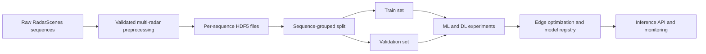

# RadarEdgeNet

RadarEdgeNet is an in-progress, reproducible edge-ML project for classifying road users from
multi-radar point clouds in the [RadarScenes dataset](https://radar-scenes.com/). The target is
an honest end-to-end system: versioned data, tested preprocessing, comparable ML and DL
experiments, an optimized edge model, a containerized inference API, cloud deployment, and
monitoring.

> **Project status:** foundation rebuild. The files under `models/`, `outputs/`, and
> `Radars_Fusion/` are legacy experiment artifacts. They are useful historical evidence but are
> not yet reproducible benchmark results.

## Why the rebuild is necessary

The original prototype proved that the dataset and edge-export workflow were approachable, but
it mixed several incompatible HDF5 schemas, used machine-specific paths, split individual samples
instead of complete sequences, and simulated a second radar view by translating a copy of the
first. Those choices can cause leakage and inflated metrics. The new pipeline starts by making the
data contract and evaluation trustworthy.

RadarScenes contains four vehicle-mounted radar sensors. Each `scenes.json` entry identifies one
sensor measurement and gives an exclusive `[start:end]` range into `radar_data.h5`; the radar
detections are already available in a common car coordinate system. See the official
[dataset structure](https://radar-scenes.com/dataset/structure/) and
[label documentation](https://radar-scenes.com/dataset/labeling/).

## Current architecture



Only the solid-line foundation through the grouped split is being rebuilt first. The complete
delivery plan and learning objectives are in [docs/ROADMAP.md](docs/ROADMAP.md), and the measured
legacy findings are preserved in [docs/AUDIT.md](docs/AUDIT.md).

## Quick start

Use Python 3.11 (recommended) or 3.12. TensorFlow is intentionally an optional dependency so data
and quality checks do not require the large DL runtime.

```bash
python3.11 -m venv .venv
source .venv/bin/activate
python -m pip install --upgrade pip
python -m pip install -e ".[dev]"
pytest
ruff check src tests
```

To install the later training stack:

```bash
python -m pip install -e ".[train,dl,viz]"
```

## Canonical processed-data contract

Each file in `data/preprocessed/` represents exactly one source sequence and contains:

| Dataset | Shape | Meaning |
| --- | --- | --- |
| `fused_point_clouds` | `(samples, 2, 1024, 4)` | Two radar views; features are x, y, compensated velocity, and RCS |
| `labels` | `(samples,)` | Original RadarScenes IDs: bicycle `5`, pedestrian `7` |

NaNs are permitted only as point padding. Processed train and validation files additionally contain
`sequence_ids`, making their provenance and leakage checks explicit.

Create deterministic, sequence-grouped splits with:

```bash
radaredgenet-prepare \
  --input-dir data/preprocessed \
  --output-dir data/processed \
  --validation-fraction 0.2 \
  --seed 42
```

The current preprocessed artifacts match the filename convention but must be regenerated after the
real sensor-pairing pipeline lands; do not use them to claim final accuracy.

## Repository layout

```text
src/radar_edge_net/   Tested application and ML pipeline code
tests/                Fast unit and contract tests
utils/                Legacy scripts being migrated into the package
Radars_Fusion/        Legacy classical fusion experiment
data/                 Existing derived data; future versions will be managed by DVC
models/               Existing model exports; future versions will come from a registry
outputs/              Historical plots
docs/                 Architecture and delivery roadmap
```

## Reproducibility rules

- Split by recording sequence, never by individual point cloud or track sample.
- Fit normalization and resampling on training data only.
- Keep dataset label IDs at storage boundaries; remap labels explicitly in model code.
- Record the code revision, data version, parameters, seed, metrics, and model artifact together.
- Report macro F1 and per-class recall alongside accuracy, latency, and artifact size.
- Never describe synthetic translated views as multi-sensor fusion.
