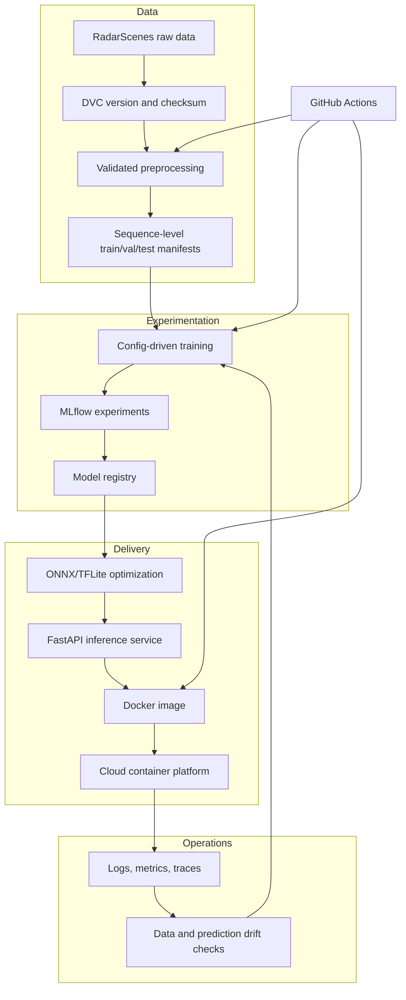

# RadarEdgeNet delivery and learning roadmap

This roadmap turns the prototype into a portfolio-quality engineering system without hiding the
research limitations. Each phase has a usable deliverable and a learning outcome. Later phases
should not begin until the acceptance gate of the previous phase is met.

## Target system

## Phase 0 — trustworthy repository foundation (current)

Deliverables:

- Installable `src/` package with Python 3.11/3.12 constraints.
- Small dependency groups instead of an exported workstation environment.
- Canonical HDF5 keys and validation.
- Sequence-grouped train/validation split with provenance stored in output files.
- Unit tests, linting, and GitHub Actions CI.
- Honest README that distinguishes legacy artifacts from reproducible results.

Acceptance gate: a clean checkout can install the development dependencies and pass lint/tests; a
schema violation fails with an actionable message; no sequence appears in two splits.

What to learn: Python packaging, dependency isolation, data contracts, leakage, and basic CI.

## Phase 1 — scientifically valid data pipeline

Deliverables:

1. Download RadarScenes outside Git and verify its published checksum and license.
2. Track raw-data metadata and derived manifests with DVC; use local storage first, then an object
   store remote.
3. Define the prediction unit precisely: object classification from a synchronized multi-radar
   snapshot or temporal object track. Do not mix both tasks in one benchmark.
4. Build real views from scene ranges in `scenes.json`. Pair measurements within a configurable
   timestamp tolerance, use the supplied car-coordinate positions, and enforce one-to-one object
   matching. Remove the translated-copy augmentation.
5. Compute normalization statistics from training sequences only.
6. Add contract tests for timestamps, sensor IDs, shapes, padding, labels, and empty tracks.
7. Respect the dataset-provided training/validation grouping and reserve untouched sequences for a
   final test when the project protocol permits it.

Acceptance gate: every processed sample points back to source sequence, scene timestamps, sensors,
and track IDs; a data report shows class and sequence counts; rebuilding the same version produces
the same manifests.

What to learn: dataset versioning, sensor frames, spatial/temporal association, validation, and
reproducibility.

## Phase 2 — baseline ML before deeper DL

Deliverables:

- A feature-based logistic regression and random-forest baseline.
- One experiment configuration per run; fixed seeds and sequence-aware cross-validation.
- No manual oversampling plus SMOTE combination until ablation proves it helps. Compare class
  weights, focal loss, and sampling independently.
- MLflow tracking for parameters, Git revision, data version, confusion matrix, macro F1,
  per-class precision/recall, calibration, latency, and model size.
- Error analysis by range, number of points, sensor pair, and sequence category.

Acceptance gate: one command reproduces a baseline run and registers its artifacts; a naive
majority baseline is included; reported improvements have repeated-seed confidence intervals.

What to learn: experiment design, imbalanced classification, metric selection, calibration, and
tracking.

## Phase 3 — meaningful deep learning

Progress in this order so complexity earns its place:

1. **Deep Sets / PointNet baseline:** shared point encoder plus masked global pooling; padding must
   not affect pooling.
2. **Learned view fusion:** encode each real radar view, then compare concatenation, attention, and
   late probability fusion.
3. **Temporal model:** add GRU/Transformer track context only after the snapshot baseline is sound.
4. **Graph model (optional):** use detection or object graphs if ablation shows spatial association
   is the bottleneck.

Use early stopping, checkpointing, learning curves, deterministic seeds where practical, and
sequence-aware validation. “PointNet++” and “DGCNN” names must only be used for faithful
implementations of those algorithms, not generic Conv1D networks.

Acceptance gate: every architecture has parameter count, macro F1, latency, memory, and an ablation
against the simpler baseline; the chosen model wins on a documented edge-oriented tradeoff, not
accuracy alone.

What to learn: point-cloud networks, attention, temporal modeling, regularization, ablation, and
GPU training.

## Phase 4 — edge optimization and serving

Deliverables:

- Export the selected checkpoint to SavedModel plus TFLite and/or ONNX.
- Verify numerical parity and evaluate dynamic, float16, and full-int8 quantization on the complete
  validation set.
- Benchmark warm and cold latency on the target edge device, not only the development computer.
- FastAPI inference service with typed request/response schemas, health/readiness endpoints,
  preprocessing parity, model metadata, structured logs, and batch limits.
- Multi-stage Docker image, non-root runtime, healthcheck, and vulnerability scan.

Acceptance gate: contract tests send a fixed sample through offline and served inference and obtain
equivalent predictions; load tests and resource limits are documented.

What to learn: serialization, quantization, APIs, Docker, testing boundaries, and performance.

## Phase 5 — cloud, CI/CD, and infrastructure

Start vendor-neutral locally, then implement one cloud path deeply. A practical AWS path is S3 for
DVC/artifacts, ECR for images, ECS Fargate for the API, CloudWatch for logs/alarms, and Terraform
for infrastructure. A free or low-cost alternative can use an OCI registry plus a small VM.

Deliverables:

- Pull-request CI: formatting/linting, unit tests, data-contract tests on fixtures, dependency and
  container scans.
- Version-tag release workflow: build/sign image, publish immutable tag, deploy to staging, smoke
  test, and require approval for production.
- Separate training workflow that is manually/schedule triggered; never retrain on every code push.
- Terraform modules, remote state, least-privilege identities, secret manager integration, budget
  alert, and teardown documentation.
- Blue/green or rolling deployment with a rollback procedure.

Acceptance gate: infrastructure can be created from code, a tagged model/image reaches staging,
failed health checks roll back, and expected monthly cost is documented.

What to learn: object storage, IAM, registries, container orchestration, IaC, CI/CD, and FinOps.

## Phase 6 — monitoring and portfolio presentation

Deliverables:

- Service telemetry: request count, failures, latency percentiles, CPU/memory, and model version.
- ML telemetry without sensitive raw payloads: feature summaries, missing/padded-point rate,
  predicted-class distribution, confidence, and drift alerts.
- A monitoring dashboard and an intentionally triggered alert demo.
- Architecture decision records, model card, data card, reproducibility instructions, short demo
  video, and a results table that includes failed ideas and limitations.
- LinkedIn write-up structured as problem → engineering choices → measured result → lessons, with
  no safety or production-readiness claims unsupported by the prototype.

Acceptance gate: a reviewer can understand the system, reproduce a small test, inspect a live demo
or recording, and see the evidence behind every performance claim.

What to learn: observability, drift, incident response, technical storytelling, and responsible ML.

## Suggested milestone order

| Milestone | Portfolio outcome |
| --- | --- |
| M1: data integrity | Reproducible dataset report and real sensor fusion |
| M2: experiments | MLflow comparison of credible ML/DL baselines |
| M3: edge artifact | Quantized model with parity and device benchmarks |
| M4: local product | Tested API, Docker Compose, metrics dashboard |
| M5: cloud product | Terraform deployment and CI/CD demonstration |
| M6: public case study | Model/data cards, architecture, demo, measured results |

